<!-- README.md is generated from README.Rmd. Please edit that file -->

# RCandy

<!-- badges: start -->
<!-- badges: end -->

RCandy plots a phylogenetic tree in context of strain metadata and
recombination events identified by Gubbins [(Croucher et al. 2015,
Nucleic Acids Research. PMID:
25414349)](https://pubmed.ncbi.nlm.nih.gov/25414349/) and BRATNextGen
[(Marttinen et al. 2012, Nucleic Acids Res. PMID:
22064866)](https://www.ncbi.nlm.nih.gov/pmc/articles/PMC3245952/).

## Installation

You can install RCandy from
[GitHub](https://github.com/ChrispinChaguza/RCandy/) with *devtools*:

``` r
install.packages("devtools")
devtools::install_github("ChrispinChaguza/RCandy")
```

Run the code below to build the vignette.

``` r
devtools::install_github("ChrispinChaguza/RCandy", build_vignettes = TRUE)
```

``` r
library(RCandy)
library(ape)
library(tidyr)
```

## Load sample data

In this example, we will load sample data for *Streptococcus pneumoniae*
sequence type (ST) 320. This data was generated using genomes described
in [*Gladstone RA et al. EBioMedicine. 2019 May;43:338-346. doi:
10.1016/j.ebiom.2019.04.021. Epub 2019 Apr 16. PMID: 31003929; PMCID:
PMC6557916*](https://pubmed.ncbi.nlm.nih.gov/31003929/)

``` r
tree.file<-system.file("extdata", "ST320.final_tree.tre", package = "RCandy",mustWork = TRUE)
metadata.file<-system.file("extdata", "ST320.tsv", package = "RCandy",mustWork = TRUE)
gubbins.gff<-system.file("extdata", "ST320.recombination_predictions.gff", package = "RCandy",
                         mustWork = TRUE)
ref.genome.gff<-system.file("extdata", "Hungary19A-6.gff", package = "RCandy",mustWork = TRUE)
```

## Running RCandy

The simplest way to run RCandy to generate the phylogenetic tree and
taxon metadata data. Here we have selected *Country* and *Source*
columns in the metadata file. It’s highly recommended that the first
column in the metadata file should contain taxon names matching the
names in the phylogenetic tree. We also specify additional options to
ladderize and root the tree at midpoint.

``` r
RCandyVis(tree.file.name = tree.file, midpoint.root = TRUE, ladderize.tree.right = TRUE, 
          taxon.metadata.file = metadata.file, taxon.metadata.columns = c("Source","Country"))
```

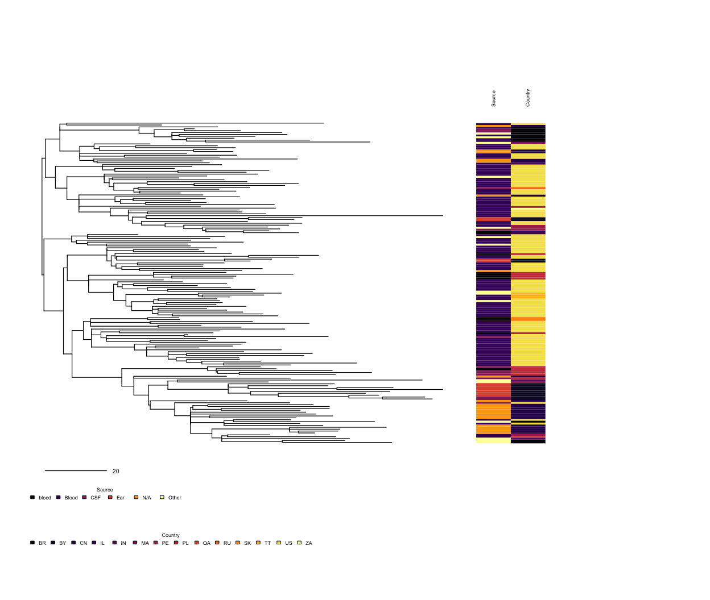

If the first column in the metadata file does not contain taxon names
then the column containing the taxon names should be explicitly
specified using *taxon.id.column* option.

``` r
RCandyVis(tree.file.name = tree.file, midpoint.root = TRUE, ladderize.tree.right = TRUE, 
          taxon.metadata.file = metadata.file, taxon.metadata.columns = c("Source","Country"),
          taxon.id.column = "ID")
```


Next we load the tree, metadata file, reference genome and recombination
events generated by
[Gubbins](\url%7Bhttps://pubmed.ncbi.nlm.nih.gov/25414349/%7D). If the
recombination events are generated by
[BRATNextGen](\url%7Bhttps://www.ncbi.nlm.nih.gov/pmc/articles/PMC3245952/%7D)
then this option *recom.input.type = “BRATNextGen”* should be specified.
By default, output from Gubbins is assumed (*recom.input.type =
“Gubbins”*).

``` r
RCandyVis(tree.file.name = tree.file, midpoint.root = TRUE, ladderize.tree.right = TRUE, 
          taxon.metadata.file = metadata.file, taxon.metadata.columns = c("Source","Country"),
          taxon.id.column = "ID", gubbins.gff.file = gubbins.gff, ref.genome.name = ref.genome.gff)
```

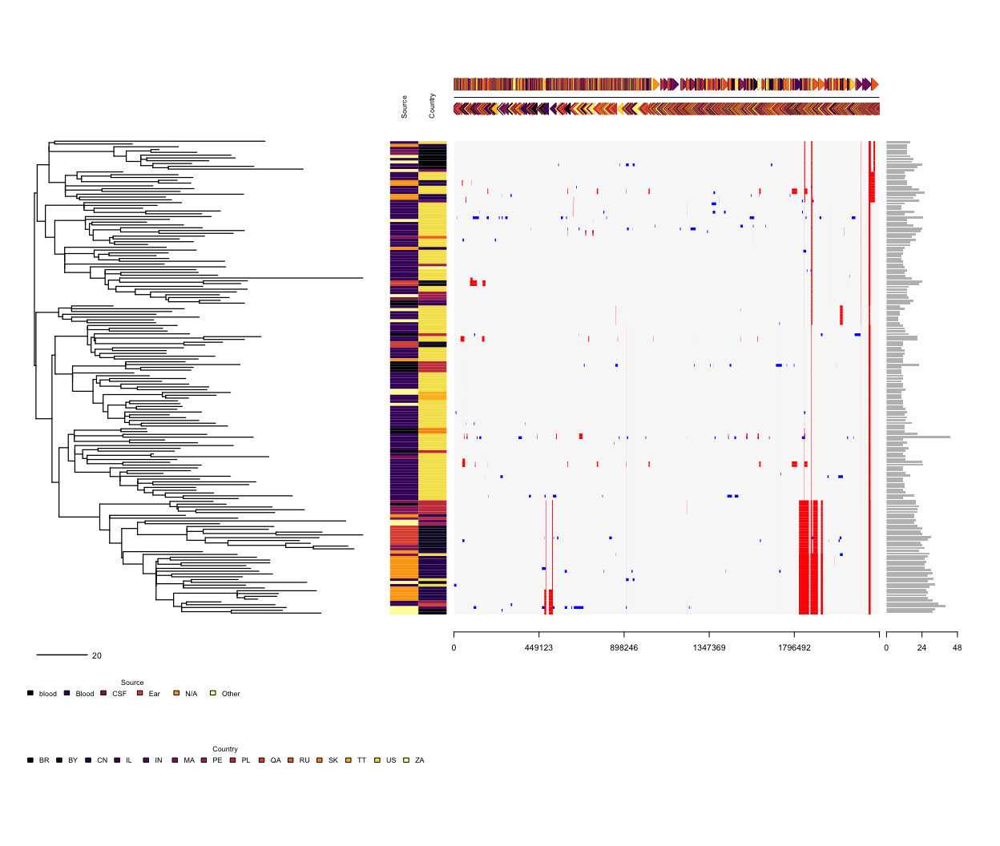

We can specify recombination events in a specific region of the genome
and show the gene labels in the reference genome annotation file. The
gene labels are turned off by default.

``` r
RCandyVis(tree.file.name = tree.file, midpoint.root = TRUE, ladderize.tree.right = TRUE, 
          taxon.metadata.file = metadata.file, taxon.metadata.columns = c("Source","Country"),
          taxon.id.column = "ID", gubbins.gff.file = gubbins.gff, ref.genome.name = ref.genome.gff,
          genome.start = 30000, genome.end = 60000, show.gene.label = TRUE)
```

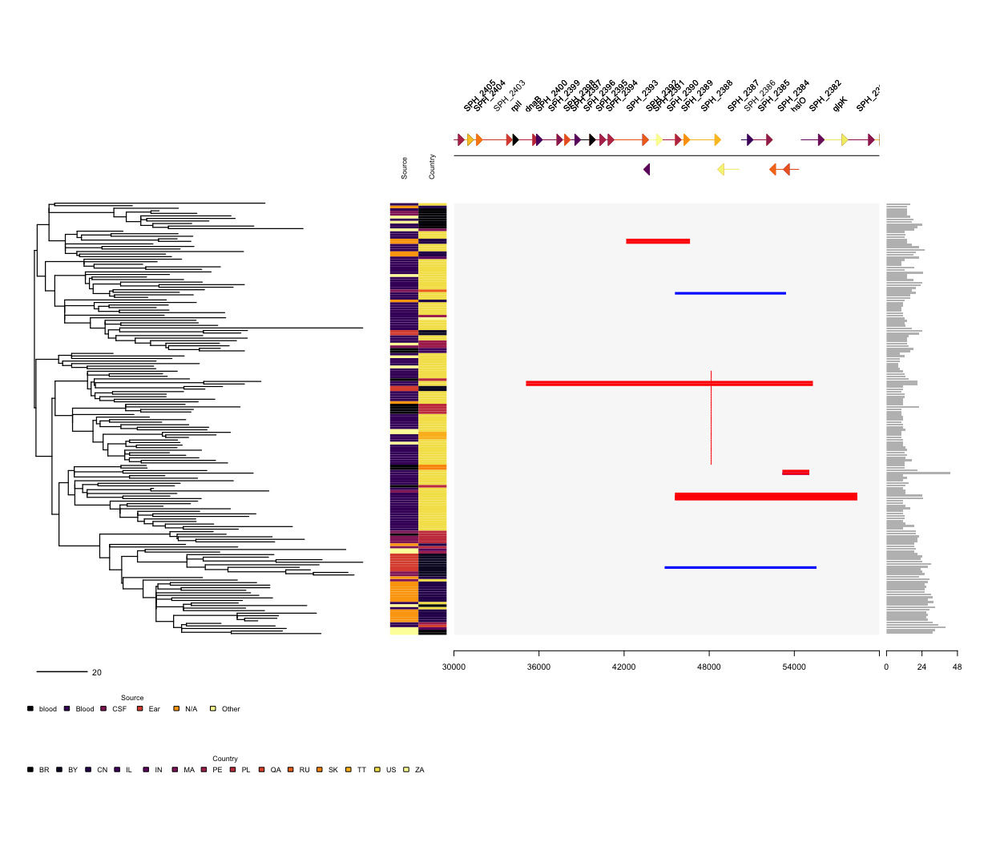

We could also colour the phylogenetic data by a column in the metadata
column. Here we will colour the tips using *Country*.

``` r
RCandyVis(tree.file.name = tree.file, midpoint.root = TRUE, ladderize.tree.right = TRUE, 
          taxon.metadata.file = metadata.file, taxon.metadata.columns = c("Source","Country"),
          taxon.id.column = "ID", gubbins.gff.file = gubbins.gff, ref.genome.name = ref.genome.gff,
          genome.start = 30000, genome.end = 60000, show.gene.label = TRUE, 
          color.tree.tips.by.column = "Country")
```

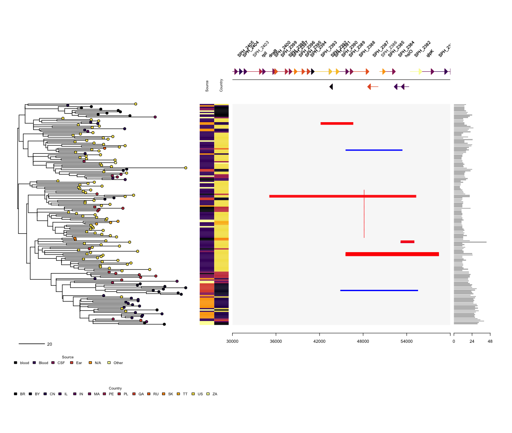

Another option, although very slow sometimes, is to map some characters
onto the phylogenetic tree nodes using discrete ancestral character
reconstruction using the *ace* function in
[*ape*](\url%7Bhttps://pubmed.ncbi.nlm.nih.gov/14734327/%7D). Below we
use the presence/absence patterns of *mefA* gene as the discrete trait.
**Warning: Ancestral character reconstruction may take some a while**.

``` r
RCandyVis(tree.file.name = tree.file, midpoint.root = TRUE, ladderize.tree.right = TRUE, 
          taxon.metadata.file = metadata.file, taxon.metadata.columns = c("Source","Country"),
          taxon.id.column = "ID", gubbins.gff.file = gubbins.gff, ref.genome.name = ref.genome.gff,
          genome.start = 30000, genome.end = 60000, show.gene.label = TRUE, 
          color.tree.tips.by.column = "Country", trait.for.ancestral.reconstr = "mefA")
#> Warning in sqrt(diag(solve(h))): NaNs produced
```

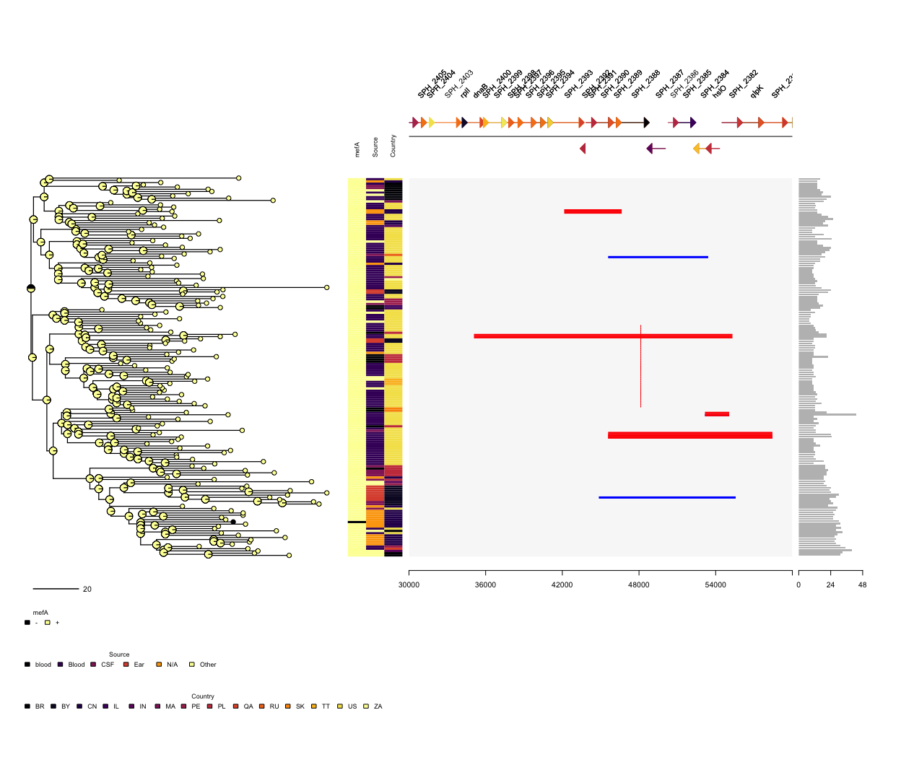

Notice that although we specified the taxon to be coloured by *Country*,
the discrete trait used for ancestral reconstruction overrides this
option. When the trait for ancestral reconstruction contains only one
value, no reconstruction is performed.

We can also customise the recombination diagram slightly by showing the
border and genome tracks using these options *show.rec.plot.border* and
*show.rec.plot.tracks* respectively.

``` r
RCandyVis(tree.file.name = tree.file, midpoint.root = TRUE, ladderize.tree.right = TRUE, 
          taxon.metadata.file = metadata.file, taxon.metadata.columns = c("Source","Country"),
          taxon.id.column = "ID", gubbins.gff.file = gubbins.gff, ref.genome.name = ref.genome.gff,
          genome.start = 30000, genome.end = 60000, show.gene.label = TRUE, 
          color.tree.tips.by.column = "Country", show.rec.plot.border = TRUE, 
          show.rec.plot.tracks = TRUE)
```

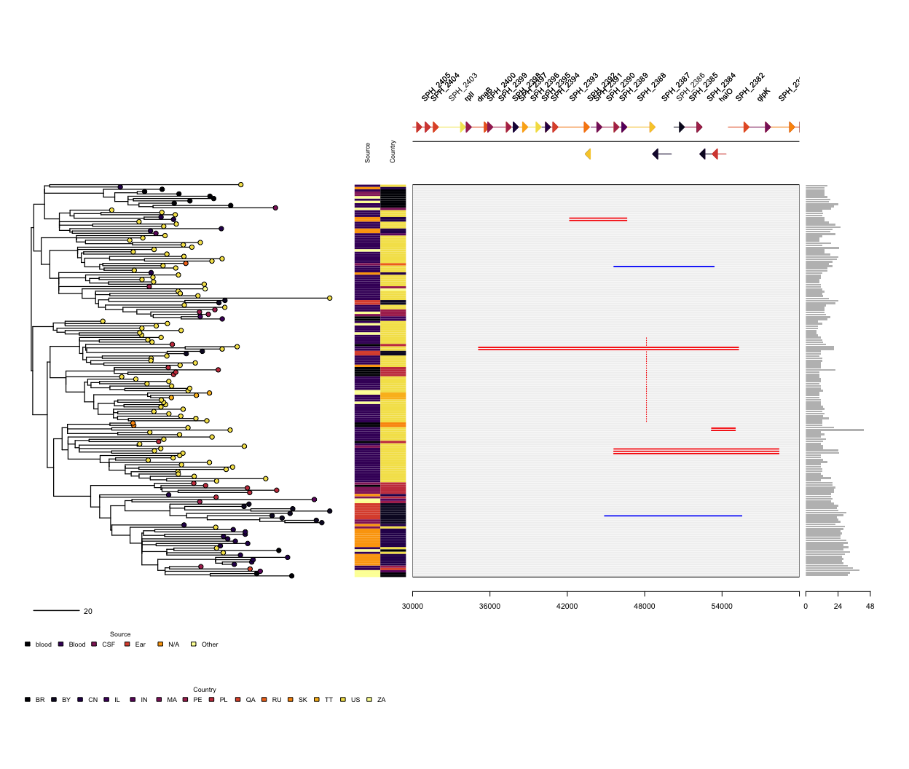

We could also turn off the background for the recombination diagram
using *show.rec.plot.bg* option.

``` r
RCandyVis(tree.file.name = tree.file, midpoint.root = TRUE, ladderize.tree.right = TRUE, 
          taxon.metadata.file = metadata.file, taxon.metadata.columns = c("Source","Country"),
          taxon.id.column = "ID", gubbins.gff.file = gubbins.gff, ref.genome.name = ref.genome.gff,
          genome.start = 30000, genome.end = 60000, show.gene.label = TRUE, 
          color.tree.tips.by.column = "Country", show.rec.plot.border = TRUE, show.rec.plot.tracks = TRUE,
          show.rec.plot.bg = FALSE)
```

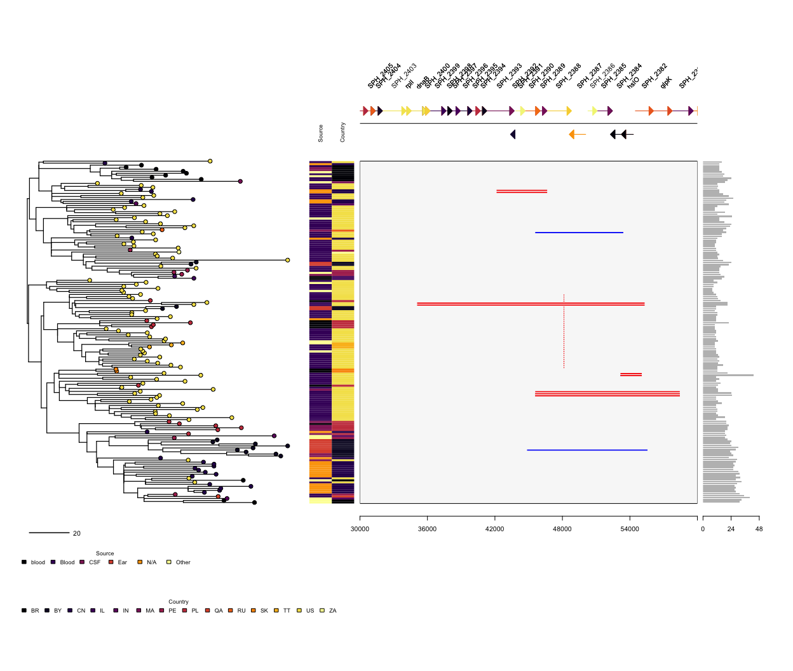

What if we need to see the specific taxon names the phylogenetic tree in
which recombination events occurred. We could specify the
*show.tip.label* certain recombination events.

``` r
RCandyVis(tree.file.name = tree.file, midpoint.root = TRUE, ladderize.tree.right = TRUE, 
          taxon.metadata.file = metadata.file, taxon.metadata.columns = c("Source","Country"),
          taxon.id.column = "ID", gubbins.gff.file = gubbins.gff, ref.genome.name = ref.genome.gff,
          genome.start = 30000, genome.end = 60000, show.gene.label = TRUE, 
          color.tree.tips.by.column = "Country", show.rec.plot.bg = TRUE, show.rec.plot.tracks = TRUE,
          show.tip.label = TRUE)
```

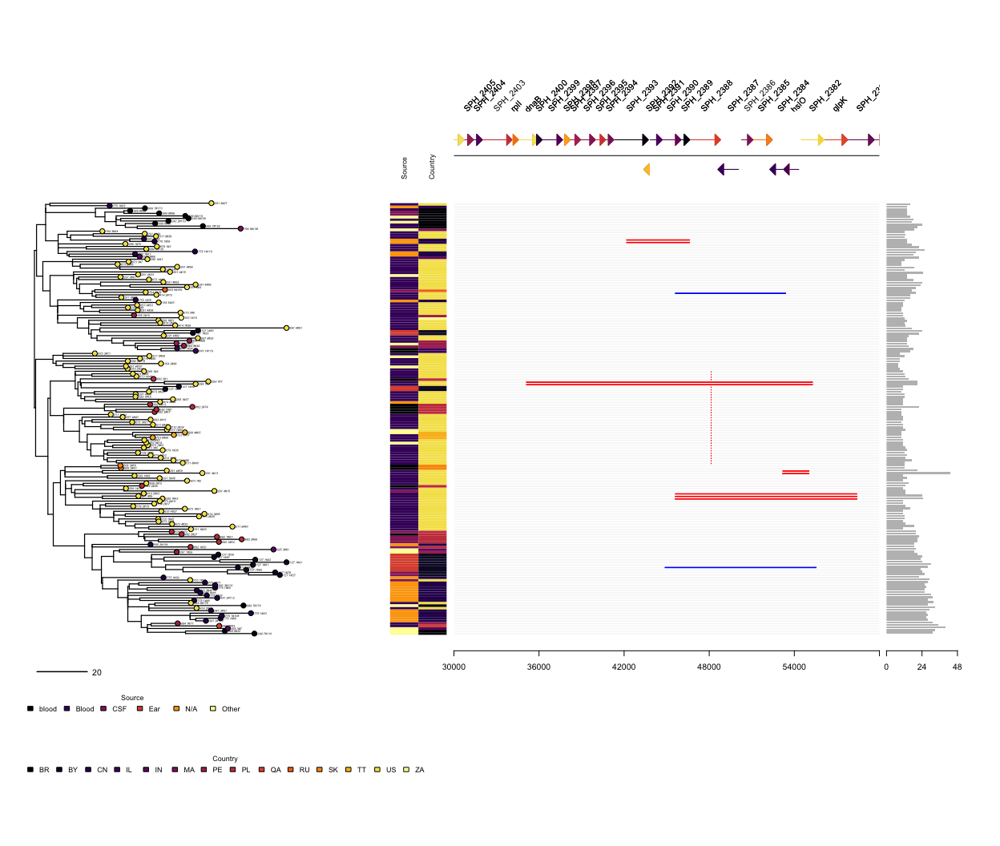

We could also change the viridis colour pallette used to represent the
metadata columns using *color.pallette*. There are five options namely
“viridis”,“inferno”,“magma”,“cividis”, and “plasma”. Below we use
“viridis” instead of the default (inferno).

``` r
RCandyVis(tree.file.name = tree.file, midpoint.root = TRUE, ladderize.tree.right = TRUE, 
          taxon.metadata.file = metadata.file, taxon.metadata.columns = c("Source","Country"),
          taxon.id.column = "ID", gubbins.gff.file = gubbins.gff, ref.genome.name = ref.genome.gff,
          genome.start = 30000, genome.end = 60000, show.gene.label = TRUE, 
          color.tree.tips.by.column = "Country", show.rec.plot.bg = TRUE, show.rec.plot.tracks = TRUE,
          color.pallette = "viridis")
```


What if we want to change the angle of the gene labels? There is a way
to do this as well using *gene.label.angle* option.

``` r
RCandyVis(tree.file.name = tree.file, midpoint.root = TRUE, ladderize.tree.right = TRUE, 
          taxon.metadata.file = metadata.file, taxon.metadata.columns = c("Source","Country"),
          taxon.id.column = "ID", gubbins.gff.file = gubbins.gff, ref.genome.name = ref.genome.gff,
          genome.start = 30000, genome.end = 60000, show.gene.label = TRUE, 
          color.tree.tips.by.column = "Country", show.rec.plot.bg = TRUE, show.rec.plot.tracks = TRUE,
          color.pallette = "viridis", gene.label.angle = 90)
```

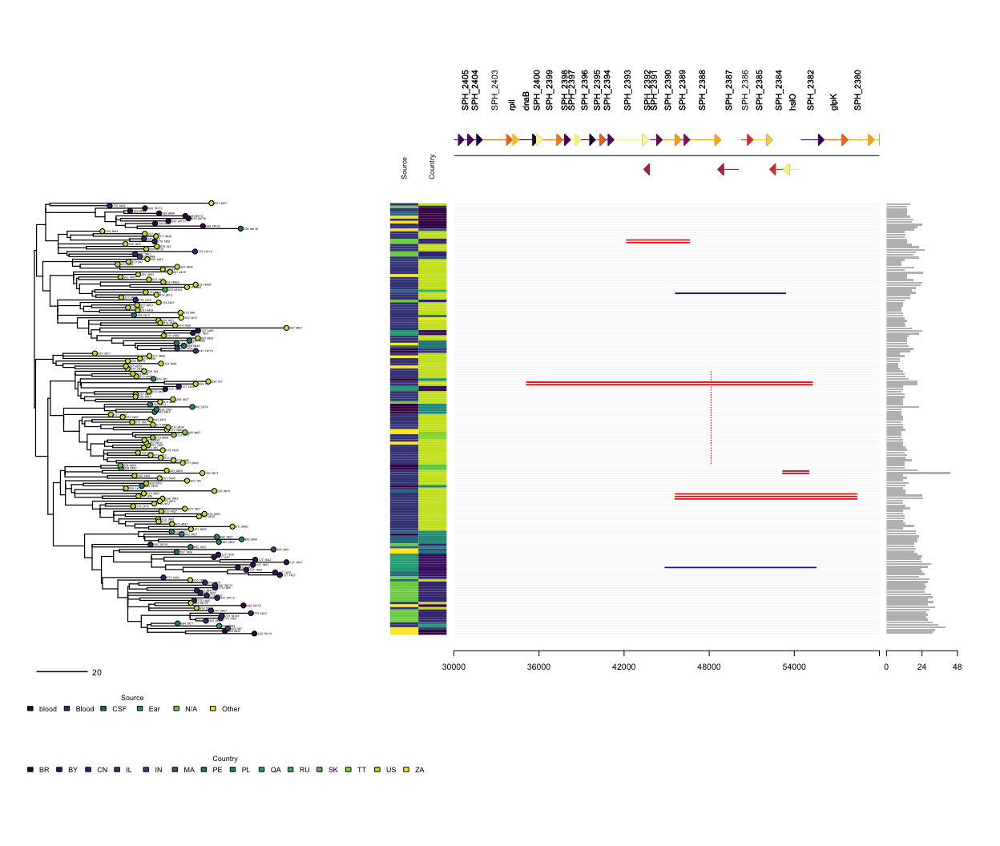

similarly, the angle of the metadata column panel can also be adjusted
using *metadata.column.label.angle*.

``` r
RCandyVis(tree.file.name = tree.file, midpoint.root = TRUE, ladderize.tree.right = TRUE, 
          taxon.metadata.file = metadata.file, taxon.metadata.columns = c("Source","Country"),
          taxon.id.column = "ID", gubbins.gff.file = gubbins.gff, ref.genome.name = ref.genome.gff,
          genome.start = 30000, genome.end = 60000, show.gene.label = TRUE, 
          color.tree.tips.by.column = "Country", show.rec.plot.bg = TRUE, show.rec.plot.tracks = TRUE,
          color.pallette = "viridis", gene.label.angle = 90,
          metadata.column.label.angle = 45)
```

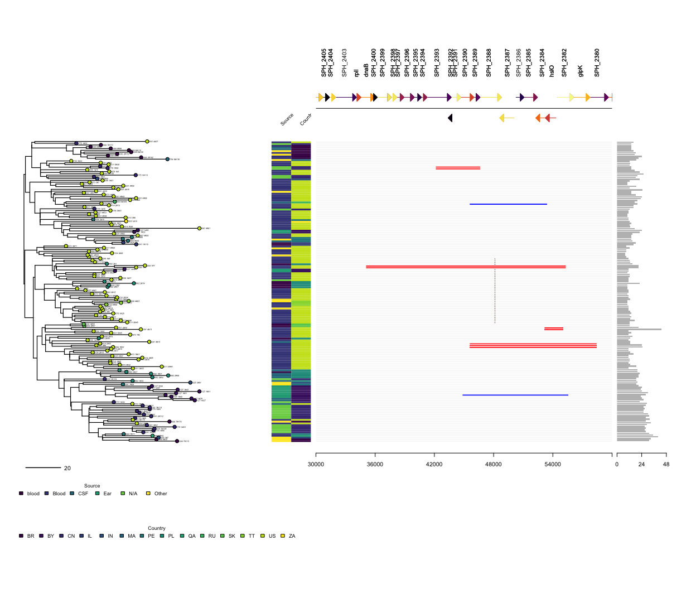

Sometimes we may want to see recombination events in specific taxa. We
could specify the taxon names to include in the figure using
*subtree.tips*. Below we specify a vector containing a subset of 50
taxon names from the full phylogenetic tree.

``` r
tree1<-ape::read.tree(tree.file)
subtree.taxa<-tree1$tip.label[1:50]

RCandyVis(tree.file.name = tree.file, midpoint.root = TRUE, ladderize.tree.right = TRUE, 
          taxon.metadata.file = metadata.file, taxon.metadata.columns = c("Source","Country"),
          taxon.id.column = "ID", gubbins.gff.file = gubbins.gff, ref.genome.name = ref.genome.gff,
          show.gene.label = FALSE, color.tree.tips.by.column = "Country", show.rec.plot.bg = TRUE,
          show.rec.plot.tracks = TRUE, subtree.tips = subtree.taxa)
```

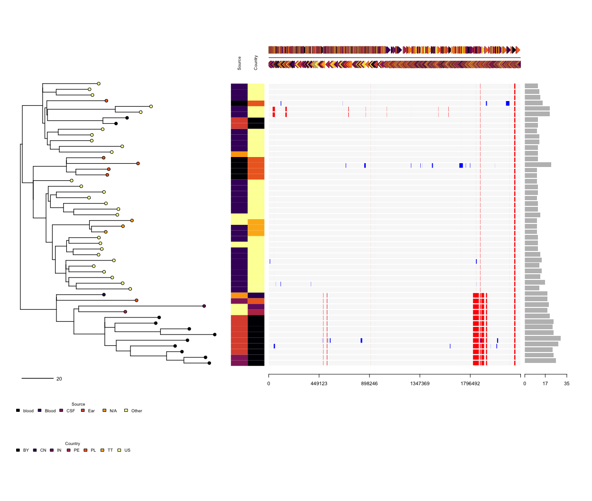

Sometimes we may want to identify recombination hotspots or genomic
regions containing many unique but overlapping recombination events.
Below we specify the *show.rec.freq.per.genome* option to turn on this
feature. **Warning: Generating recombination frequency plot may take
some a while**.

``` r
tree1<-ape::read.tree(tree.file)
subtree.taxa<-tree1$tip.label[1:50]

RCandyVis(tree.file.name = tree.file, midpoint.root = TRUE, ladderize.tree.right = TRUE, 
          taxon.metadata.file = metadata.file, taxon.metadata.columns = c("Source","Country"),
          taxon.id.column = "ID", gubbins.gff.file = gubbins.gff, ref.genome.name = ref.genome.gff,
          show.gene.label = FALSE, color.tree.tips.by.column = "Country", show.rec.plot.bg = TRUE,
          show.rec.plot.tracks = TRUE, show.rec.freq.per.genome = TRUE)
```

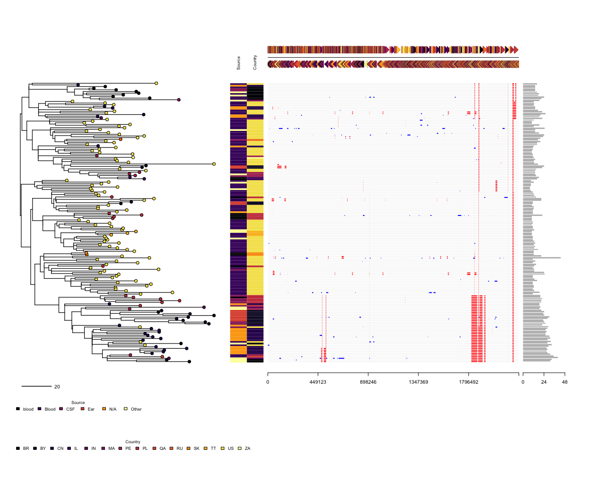

Another interesting feature is the ability to specify preloaded files
for plotting. In the example below we use example dataset containing
preloaded objects for the phylogenetic tree, metadata, recombination
events
([GFF](\url%7Bhttps://en.wikipedia.org/wiki/General_feature_format%7D))
and reference genome (GFF).

``` r
data("RCandy")

tree<-RCandy$tree
metadata<-RCandy$metadata
gubbins.GFF<-RCandy$refgenome.GFF 
refgenome.GFF<-RCandy$gubbins.GFF
```

Then we plot the recombination events using the same code as above.

``` r
RCandyVis(tree.file.name = tree.file, midpoint.root = TRUE, ladderize.tree.right = TRUE, 
          taxon.metadata.file = metadata.file, taxon.metadata.columns = c("Source","Country"),
          taxon.id.column = "ID", gubbins.gff.file = gubbins.gff, ref.genome.name = ref.genome.gff,
          color.tree.tips.by.column = "Country", show.rec.plot.bg = TRUE, show.rec.plot.tracks = TRUE,
          color.pallette = "inferno", gene.label.angle = 90)
```


The data objects used above can be loaded in the correct format using
the code below.

``` r
tree.file<-system.file("extdata", "ST320.final_tree.tre", package = "RCandy",mustWork = TRUE)
metadata.file<-system.file("extdata", "ST320.tsv", package = "RCandy",mustWork = TRUE)
gubbins.gff<-system.file("extdata", "ST320.recombination_predictions.gff", package = "RCandy",mustWork = TRUE)
ref.genome.gff<-system.file("extdata", "Hungary19A-6.gff", package = "RCandy",mustWork = TRUE)
```

Then we read the location of the phylogenetic tree file name stored in
the variable *tree.file*, metadata file name in *metadata.file*,
recombination events file in GFF format in *gubbins.gff*, and reference
genome file in GFF format in *ref.genome.gff*.

``` r
tree<-ape::read.tree(tree.file)
metadata<-tidyr::as_tibble(read.table(metadata.file,header=T,sep="\t",comment.char="?"))
gubbins.GFF<-load.gubbins.GFF(gubbins.gff) 
refgenome.GFF<-load.genome.GFF(ref.genome.gff)
```

Let’s draw the recombination plot again to see if the data was loaded
correctly.

``` r
RCandyVis(tree.file.name = tree.file, midpoint.root = TRUE, ladderize.tree.right = TRUE, 
          taxon.metadata.file = metadata.file, taxon.metadata.columns = c("Source","Country"),
          taxon.id.column = "ID", gubbins.gff.file = gubbins.gff, ref.genome.name = ref.genome.gff,
          color.tree.tips.by.column = "Country", show.rec.plot.bg = TRUE, 
          show.rec.plot.tracks = TRUE, color.pallette = "inferno", 
          gene.label.angle = 90)
```

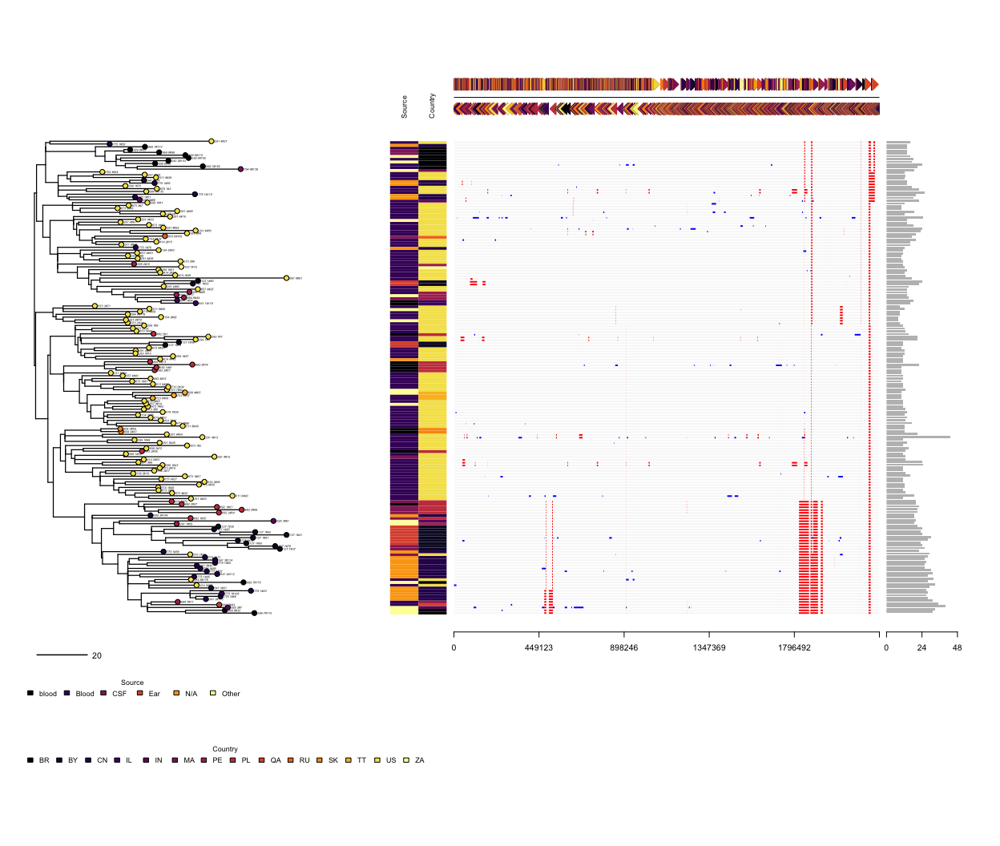

## Other options

There are many options that can be used to customise the plots. These
include hiding the figure legend using *show.fig.legend*, hiding the
number of recombination events identified in each genome
*show.rec.freq.per.genome*, hiding metadata columns
*show.metadata.columns*, save the plot to a PDF file (or other types
including PNG, JPG and SVG) using *save.to.this.file* for use in
publications either directly or editing in Inkscape and Adobe
Illustrator, and adjusting plot height and width using *plot.height* and
*plot.width* respectively.

## Some suggestions

We recommend using [readseq](https://sourceforge.net/projects/readseq/)
to convert the reference genome annotation to the GFF format. Other
tools can also be used but *readseq* is recommended to get the best
results.

Another similar tool for interactive visualisation of recombination
events is *Phandango* available
[here](https://jameshadfield.github.io/phandango/#/) and described
[here](https://academic.oup.com/bioinformatics/article/34/2/292/4212949).
If you are only interested in visualising the phylogenetic tree and
associated metadata without recombination events,
[*ggtree*](https://github.com/YuLab-SMU/ggtree) and
[*microreact*](https://microreact.org/showcase) offer many useful
functionalities.

## Session info

``` r
sessionInfo()
#> R version 4.0.3 (2020-10-10)
#> Platform: x86_64-apple-darwin17.0 (64-bit)
#> Running under: macOS Mojave 10.14.6
#> 
#> Matrix products: default
#> BLAS:   /Library/Frameworks/R.framework/Versions/4.0/Resources/lib/libRblas.dylib
#> LAPACK: /Library/Frameworks/R.framework/Versions/4.0/Resources/lib/libRlapack.dylib
#> 
#> locale:
#> [1] en_US.UTF-8/en_US.UTF-8/en_US.UTF-8/C/en_US.UTF-8/en_US.UTF-8
#> 
#> attached base packages:
#> [1] stats     graphics  grDevices utils     datasets  methods   base     
#> 
#> other attached packages:
#> [1] tidyr_1.1.2  ape_5.4-1    RCandy_1.0.0
#> 
#> loaded via a namespace (and not attached):
#>  [1] phangorn_2.5.5          shape_1.4.5             gtools_3.8.2           
#>  [4] tidyselect_1.1.0        xfun_0.19               purrr_0.3.4            
#>  [7] lattice_0.20-41         phytools_0.7-70         colorspace_2.0-0       
#> [10] vctrs_0.3.6             generics_0.1.0          expm_0.999-6           
#> [13] htmltools_0.5.0         viridisLite_0.3.0       yaml_2.2.1             
#> [16] rlang_0.4.10            pillar_1.4.7            glue_1.4.2             
#> [19] lifecycle_1.0.0         stringr_1.4.0           munsell_0.5.0          
#> [22] combinat_0.0-8          gtable_0.3.0            coda_0.19-4            
#> [25] evaluate_0.14           knitr_1.30              parallel_4.0.3         
#> [28] Rcpp_1.0.6              scales_1.1.1            plotrix_3.8-1          
#> [31] clusterGeneration_1.3.7 scatterplot3d_0.3-41    tmvnsim_1.0-2          
#> [34] gridExtra_2.3           fastmatch_1.1-0         mnormt_2.0.2           
#> [37] ggplot2_3.3.3           digest_0.6.27           stringi_1.5.3          
#> [40] dplyr_1.0.2             numDeriv_2016.8-1.1     grid_4.0.3             
#> [43] quadprog_1.5-8          tools_4.0.3             magrittr_2.0.1         
#> [46] maps_3.3.0              tibble_3.0.6            crayon_1.4.1           
#> [49] pkgconfig_2.0.3         MASS_7.3-53             ellipsis_0.3.1         
#> [52] Matrix_1.2-18           rmarkdown_2.5           viridis_0.5.1          
#> [55] R6_2.5.0                igraph_1.2.6            nlme_3.1-150           
#> [58] compiler_4.0.3
```

## References

-   Croucher NJ, Page AJ, Connor TR, Delaney AJ, Keane JA, Bentley SD,
    Parkhill J, Harris SR. Rapid phylogenetic analysis of large samples
    of recombinant bacterial whole genome sequences using Gubbins.
    Nucleic Acids Res. 2015 Feb 18;43(3):e15. doi: 10.1093/nar/gku1196.
    Epub 2014 Nov 20. PMID: 25414349; PMCID:
    PMC4330336.<https://pubmed.ncbi.nlm.nih.gov/25414349/>.

-   Marttinen P, Hanage WP, Croucher NJ, Connor TR, Harris SR, Bentley
    SD, Corander J. Detection of recombination events in bacterial
    genomes from large population samples. Nucleic Acids Res. 2012
    Jan;40(1):e6. doi: 10.1093/nar/gkr928. Epub 2011 Nov 7. PMID:
    22064866; PMCID: PMC3245952.
    <https://pubmed.ncbi.nlm.nih.gov/22064866/>.
